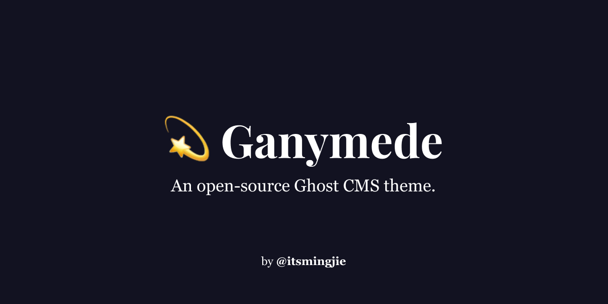

# 💫 Ganymede 

Ganymede is a content-focused, deploy-ready theme for [Ghost](http://github.com/tryghost/ghost/), designed for my personal [website and blog](https://mingjie.info).

The theme is based on [Callisto](https://github.com/jckyeh/Callisto-Ghost-Theme) by [@jckyeh](https://github.com/jckyeh/).

## Improvements

-   [x] Better font & reading experience
-   [x] Better structure for repeating elements
-   [x] Clean-up unused and unnecessary elements
-   [x] Metadata display on post list
-   [x] Hover preloading via [instant.page](https://instant.page/)
-   [x] Support for some Ghost 3.0 features, including bookmarks
-   [x] Autodeploy to my Ghost instance via GitHub Actions
-   [x] Preview post special styling & formatting
-   [x] Featured post display order
-   [x] Image lightbox via [Fluidbox](https://github.com/terrymun/Fluidbox)
-   [x] Complete CSS dark mode support based on [Andy Bell](https://hankchizljaw.com/wrote/create-a-user-controlled-dark-or-light-mode/)'s guide.

## Copyright & License

Copyright (c) 2019-2020 Mingjie Jiang - Released under the [MIT license](LICENSE).

Original work by [Jack Yeh](https://github.com/jckyeh/) - Released under the MIT License.

[instant.page](https://github.com/instantpage/instant.page/) by [Alexandre Dieulot](https://dieulot.fr/) - Released under the MIT License.
